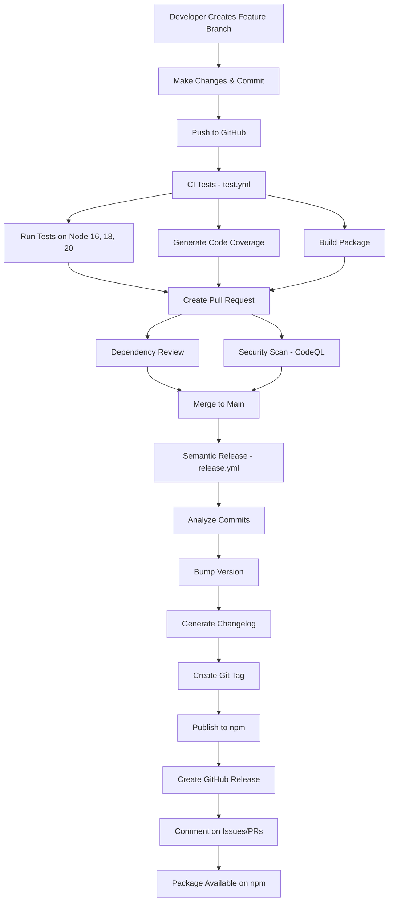

# Distribution & CI/CD Setup Complete

## Overview

Your Editium package now has a complete, professional-grade CI/CD pipeline with automated testing, versioning, and npm publishing.

---

## Files Created

### Distribution Configuration

1. **`.npmignore`**
   - Excludes source, tests, and config files from npm package
   - Only ships compiled `dist/` folder
   - Keeps package size small

### GitHub Actions Workflows

2. **`.github/workflows/test.yml`** - CI Testing
   - Runs on every push and PR
   - Tests on Node.js 16.x, 18.x, 20.x
   - Generates code coverage
   - Uploads to Codecov

3. **`.github/workflows/release.yml`** - Semantic Release
   - Runs on push to main branch
   - Analyzes commits for version bump
   - Generates changelog
   - Creates GitHub release
   - Publishes to npm automatically

4. **`.github/workflows/publish.yml`** - Manual Publishing
   - Triggered by manual GitHub releases
   - Alternative publishing method
   - Includes test validation

5. **`.github/workflows/dependency-review.yml`** - Dependency Security
   - Scans PRs for vulnerable dependencies
   - Checks license compliance
   - Blocks problematic packages

6. **`.github/workflows/codeql.yml`** - Security Analysis
   - Scans code for security issues
   - Runs on push, PR, and weekly schedule
   - Reports to GitHub Security tab

### Semantic Release Configuration

7. **`.releaserc.json`**
   - Configures semantic-release behavior
   - Defines version bump rules
   - Changelog generation settings
   - GitHub and npm integration

### Documentation

8. **`CI_CD_DOCUMENTATION.md`** - Complete Guide
   - Detailed workflow explanations
   - Setup instructions
   - Commit conventions
   - Troubleshooting guide

9. **`QUICK_START_CICD.md`** - Quick Setup Guide
   - Step-by-step setup
   - First release walkthrough
   - Common tasks

10. **`CICD_SETUP_SUMMARY.md`** - This file
    - Overview of all changes
    - What you need to do next

---

## Dependencies Added

Installed semantic-release and plugins:

```json
{
  "devDependencies": {
    "semantic-release": "^24.2.1",
    "@semantic-release/changelog": "^6.0.3",
    "@semantic-release/git": "^10.0.1",
    "@semantic-release/github": "^11.0.0",
    "conventional-changelog-conventionalcommits": "^8.0.0"
  }
}
```

## Package.json Updates

Added script:
```json
{
  "scripts": {
    "semantic-release": "semantic-release"
  }
}
```

---

## What Happens Now

### On Every Push/PR

1. Tests run automatically
2. Code is built and verified
3. Dependencies are scanned
4. Security analysis runs
5. Coverage reports generated

### On Push to Main (with conventional commits)

1. Semantic-release analyzes commits
2. Determines next version number
3. Generates changelog
4. Creates Git tag
5. Publishes to npm
6. Creates GitHub release
7. Comments on related issues/PRs

---

## Next Steps

### Required Setup (5 minutes)

1. **Add npm Token to GitHub Secrets:**
   - Get token from https://www.npmjs.com/settings/tokens
   - Add as `NPM_TOKEN` in repo secrets
   - See: [QUICK_START_CICD.md](./QUICK_START_CICD.md)

2. **Enable GitHub Actions:**
   - Settings → Actions → General
   - Set "Read and write permissions"
   - Allow creating PRs

3. **Test the Pipeline:**
   ```bash
   git add .
   git commit -m "ci: add GitHub Actions workflows"
   git push origin main
   ```

### Optional Setup

4. **Add Codecov Token** (for coverage tracking)
   - Sign up at https://codecov.io
   - Add `CODECOV_TOKEN` to secrets

5. **Protect Main Branch**
   - Settings → Branches
   - Require status checks before merge

6. **Add Status Badges to README**
   ```markdown
   [](https://github.com/NabarupDev/Editium/actions)
   [](https://www.npmjs.com/package/editium)
   ```

---

## Commit Message Convention

Use these prefixes for automatic versioning:

| Prefix | Version Bump | Example |
|--------|--------------|---------|
| `feat:` | Minor (1.0.0 → 1.1.0) | `feat: add table support` |
| `fix:` | Patch (1.0.0 → 1.0.1) | `fix: correct toolbar bug` |
| `BREAKING CHANGE:` | Major (1.0.0 → 2.0.0) | In commit body |
| `docs:`, `test:`, etc. | No bump | Updates without release |

**Example:**
```bash
# Minor version bump
git commit -m "feat(editor): add image resize feature"

# Patch version bump
git commit -m "fix(toolbar): correct alignment button"

# Major version bump
git commit -m "feat!: redesign API

BREAKING CHANGE: removed deprecated props"
```

---

## Workflow Overview



### Workflow Stages

1. **Development**: Create feature branch, make changes with conventional commits
2. **CI Testing**: Automated tests run on multiple Node.js versions
3. **Code Quality**: Coverage reports and package build verification
4. **Pull Request**: Dependency review and security scanning
5. **Merge**: Changes merged to main branch
6. **Release**: Semantic-release automates versioning and publishing
7. **Distribution**: Package published to npm and GitHub releases created

---

## Monitoring & Reports

### GitHub Actions
- **Location:** Repository → Actions tab
- **View:** Workflow runs, logs, artifacts
- **Status:** Pass/fail for each job

### npm Package
- **Location:** https://www.npmjs.com/package/editium
- **View:** Downloads, versions, files
- **Stats:** Usage statistics

### Code Coverage
- **Location:** https://codecov.io/gh/NabarupDev/Editium
- **View:** Coverage %, trends, files
- **Reports:** Line-by-line coverage

### Security
- **Location:** Repository → Security tab
- **View:** Dependabot alerts, CodeQL results
- **Actions:** Review and fix vulnerabilities

---

## Secrets Required

Configure these in Settings → Secrets and variables → Actions:

| Secret Name | Required | Purpose |
|-------------|----------|---------|
| `NPM_TOKEN` | ✅ Yes | Publish to npm |
| `CODECOV_TOKEN` | ⭕ Optional | Upload coverage |
| `GITHUB_TOKEN` | ✅ Auto | GitHub API access |

---

## Features Enabled

**Continuous Integration**
- Automated testing on every commit
- Multi-version Node.js support (16, 18, 20)
- Build verification
- Test coverage tracking

**Continuous Deployment**
- Automated npm publishing
- Semantic versioning
- Changelog generation
- GitHub releases

**Security**
- Dependency vulnerability scanning
- License compliance checking
- CodeQL security analysis
- Weekly security audits

**Quality Assurance**
- Test coverage reporting
- Build artifact uploads
- Status checks on PRs
- Branch protection ready

---

## Documentation

All documentation is available in:

1. **[CI_CD_DOCUMENTATION.md](./CI_CD_DOCUMENTATION.md)**
   - Complete reference guide
   - Detailed explanations
   - Troubleshooting

2. **[QUICK_START_CICD.md](./QUICK_START_CICD.md)**
   - Quick setup guide
   - Step-by-step instructions
   - Common tasks

3. **Workflow files** (`.github/workflows/*.yml`)
   - Inline comments
   - Configuration examples

---

## Success Checklist

Before your first release:

- [ ] npm token added to GitHub secrets
- [ ] GitHub Actions enabled with write permissions
- [ ] Test workflow runs successfully
- [ ] Commit messages follow convention
- [ ] README updated with badges (optional)
- [ ] Branch protection configured (optional)

After first release:

- [ ] Package appears on npm
- [ ] GitHub release created
- [ ] Changelog generated
- [ ] Version number correct
- [ ] Installation works: `npm install editium`

---

## Getting Help

If you encounter issues:

1. Check [QUICK_START_CICD.md](./QUICK_START_CICD.md) troubleshooting section
2. Review workflow logs in Actions tab
3. Check [CI_CD_DOCUMENTATION.md](./CI_CD_DOCUMENTATION.md) for detailed info
4. Verify secrets are set correctly
5. Ensure commit messages follow convention

---

## Summary

Your Editium package now has:

- Complete CI/CD pipeline
- Automated testing (110 tests)
- Semantic versioning
- Automated npm publishing
- Security scanning
- Code quality checks
- Professional workflows

**Everything is ready! Just add your npm token and start shipping!**

---

*Generated on: $(date)*
*Package: editium*
*Version: 1.0.0*
