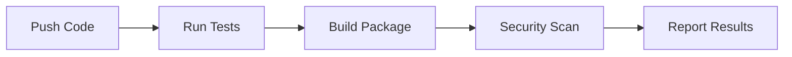
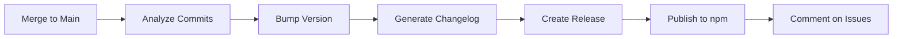

# CI/CD Setup Complete

## What Was Created

### Distribution Files
```
.npmignore                           ← Excludes dev files from npm package
```

### GitHub Actions Workflows
```
.github/
└── workflows/
    ├── test.yml                     ← CI: Tests on Node 16, 18, 20
    ├── release.yml                  ← CD: Semantic versioning & publishing
    ├── publish.yml                  ← Manual npm publishing
    ├── dependency-review.yml        ← Security: Dependency scanning
    └── codeql.yml                   ← Security: Code analysis
```

### Configuration Files
```
.releaserc.json                      ← Semantic-release configuration
package.json                         ← Added semantic-release script
```

### Documentation
```
CI_CD_DOCUMENTATION.md               ← Complete CI/CD guide
QUICK_START_CICD.md                  ← Quick setup instructions
CICD_SETUP_SUMMARY.md                ← This summary
BADGES.md                            ← README badge suggestions
```

---

## Package Structure

### What Gets Published to npm:
```
editium/
├── dist/                            Compiled code
│   ├── index.js
│   ├── index.esm.js
│   └── index.d.ts
├── README.md                        Documentation
└── LICENSE                          License file
```

### What Stays in GitHub Only:
```
src/                              Source TypeScript files
test/                             Test files
example/                          Example application
.github/                          CI/CD workflows
node_modules/                     Dependencies
coverage/                         Test coverage reports
*.config.js/ts                    Configuration files
```

---

## Automated Workflow

### On Every Push/Pull Request:



1. **Tests Execute** (Node 16, 18, 20)
2. **Package Builds**
3. **Dependencies Scanned**
4. **Code Analyzed**
5. **Coverage Reported**

### On Push to Main (with proper commits):



1. **Semantic Release Analyzes** commit messages
2. **Version Number Bumped** (major/minor/patch)
3. **CHANGELOG.md Generated** with all changes
4. **Git Tag Created** (e.g., v1.2.3)
5. **Package Published** to npm
6. **GitHub Release Created** with notes
7. **Issues/PRs Commented** with release info

---

## Version Bump Logic

| Commit Type | Example | Version Change |
|------------|---------|----------------|
| `fix:` | `fix: toolbar bug` | 1.0.0 → 1.0.1 (patch) |
| `feat:` | `feat: add tables` | 1.0.0 → 1.1.0 (minor) |
| `BREAKING CHANGE:` | API redesign | 1.0.0 → 2.0.0 (major) |
| `docs:`, `test:`, etc. | Documentation | No version change |

---

## Setup Status

### Completed
- [x] Created all workflow files
- [x] Configured semantic-release
- [x] Added .npmignore
- [x] Installed dependencies
- [x] Created documentation
- [x] Added npm scripts

### Required (You Need to Do)
- [ ] Add `NPM_TOKEN` to GitHub Secrets
- [ ] Enable GitHub Actions permissions
- [ ] Test first workflow run

### Optional (Recommended)
- [ ] Add `CODECOV_TOKEN` for coverage
- [ ] Protect main branch
- [ ] Add status badges to README
- [ ] Set up branch protection rules

---

## Quick Start Commands

### Run Tests
```bash
npm test                    # Run all tests once
npm run test:watch          # Watch mode
npm run test:coverage       # With coverage report
```

### Build Package
```bash
npm run build              # Build once
npm run dev                # Build in watch mode
```

### Release (Automatic)
```bash
# Just commit and push to main with conventional format
git commit -m "feat: add new feature"
git push origin main
# Semantic-release handles the rest!
```

### Release (Manual)
```bash
# Create and push tag
git tag v1.0.1
git push origin v1.0.1

# Or create GitHub release in UI
```

---

## Monitoring Your Package

### GitHub Actions
- **URL:** `https://github.com/NabarupDev/Editium/actions`
- **Check:** Workflow runs, test results, logs

### npm Package
- **URL:** `https://www.npmjs.com/package/editium`
- **Check:** Version, downloads, files

### Code Coverage
- **URL:** `https://codecov.io/gh/NabarupDev/Editium`
- **Check:** Coverage %, trends (after setup)

### Security
- **URL:** `https://github.com/NabarupDev/Editium/security`
- **Check:** Vulnerabilities, CodeQL alerts

---

## Example: Making Your First Release

### Step 1: Make Changes
```bash
git checkout -b feat/awesome-feature
# ... make changes ...
```

### Step 2: Commit (Conventional Format)
```bash
git add .
git commit -m "feat: add awesome new feature

This adds support for XYZ feature that allows users to do ABC."
```

### Step 3: Push and Create PR
```bash
git push origin feat/awesome-feature
# Create PR on GitHub
```

### Step 4: Tests Run Automatically
- Tests pass on Node 16, 18, 20
- Build succeeds
- Dependencies scanned
- Code analyzed

### Step 5: Merge to Main
```bash
# After PR approval
git checkout main
git merge feat/awesome-feature
git push origin main
```

### Step 6: Semantic Release Magic
- Analyzes: "feat:" = minor version bump
- Bumps: 1.0.0 → 1.1.0
- Generates: CHANGELOG.md entry
- Creates: Git tag v1.1.0
- Publishes: Package to npm
- Creates: GitHub release
- Comments: On related issues/PRs

### Step 7: Package Available!
```bash
npm install editium@1.1.0
# Your feature is live!
```

---

## Pro Tips

### 1. Use Conventional Commits
```bash
# Good
git commit -m "feat: add dark mode support"
git commit -m "fix: resolve toolbar alignment issue"
git commit -m "docs: update installation guide"

# Bad
git commit -m "updated stuff"
git commit -m "fix"
git commit -m "changes"
```

### 2. Write Detailed Commit Messages
```bash
feat: add keyboard shortcuts

- Added Ctrl+B for bold
- Added Ctrl+I for italic
- Added Ctrl+U for underline
- Updated documentation

Closes #123
```

### 3. Use Breaking Changes Carefully
```bash
feat!: redesign editor API

BREAKING CHANGE: The `onChange` prop now returns both HTML and JSON.
Migration: Change `onChange={(html) => ...}` to `onChange={(html, json) => ...}`
```

### 4. Protect Your Main Branch
- Require PR reviews
- Require status checks
- Prevent force pushes
- Keep history clean

---

## Customization Options

### Modify Semantic Release Rules
Edit `.releaserc.json` to change:
- Version bump logic
- Changelog sections
- Release notes format
- Plugin behavior

### Customize Workflows
Edit `.github/workflows/*.yml` to:
- Add more test environments
- Include linting steps
- Add deployment steps
- Configure notifications

### Adjust npm Package
Edit `.npmignore` or `package.json` "files" to:
- Include/exclude specific files
- Optimize package size
- Add additional assets

---

## Additional Resources

### Documentation
- [CI/CD Full Guide](./CI_CD_DOCUMENTATION.md)
- [Quick Start Guide](./QUICK_START_CICD.md)
- [Badge Suggestions](./BADGES.md)

### External Links
- [Conventional Commits](https://www.conventionalcommits.org/)
- [Semantic Release](https://semantic-release.gitbook.io/)
- [GitHub Actions](https://docs.github.com/en/actions)
- [npm Publishing](https://docs.npmjs.com/packages-and-modules)

---

## Summary

### What You Now Have:

**Professional CI/CD Pipeline**
- Automated testing
- Multi-version support
- Security scanning
- Code quality checks

**Automated Publishing**
- Semantic versioning
- Changelog generation
- npm publishing
- GitHub releases

**Best Practices**
- Conventional commits
- Branch protection ready
- Security monitoring
- Quality assurance

**Documentation**
- Complete guides
- Quick start instructions
- Troubleshooting help
- Examples

### Next Steps:

1. **Add npm token** to GitHub Secrets
2. **Enable** GitHub Actions permissions
3. **Test** by pushing a commit
4. **Make** your first release!

---

*Document generated: October 7, 2025*
